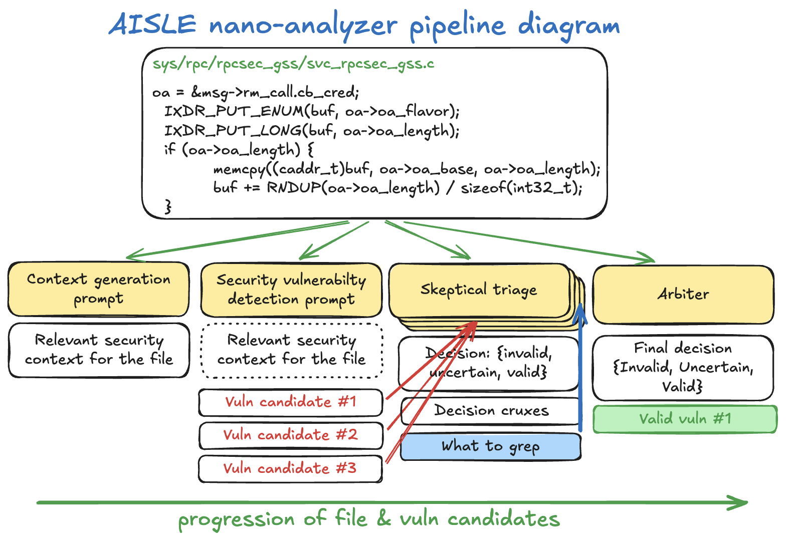

# Nano-analyzer

**A minimal LLM-powered zero-day vulnerability scanner by [AISLE](https://aisle.com), adapted for local Codex CLI / Claude Code workflows.**

This is a modified version of AISLE's nano-analyzer prototype. The original
scanner design, prompts, and core pipeline are credited to AISLE; this fork
keeps that foundation and adds a use case focused on running the analyzer
through locally authenticated coding CLIs without requiring API keys.



> **Research prototype for demonstration purposes.** This is a simple, single-file harness that is able to detect real zero-day vulnerabilities. Note that it is a prototype, biased towards C/C++ memory safety bugs, and will produce false positives. We are sharing it as-is in the spirit of open research — expect sharp corners.

## What it does

Nano-analyzer is a simple single-file Python scanner that sends source code through a three-stage LLM pipeline:

1. **Context generation** — a model writes a security briefing about the file: what it does, where untrusted data flows, which buffers exist and how big they are.
2. **Vulnerability scan** — the same model, primed with the context, hunts for zero-day bugs function by function and outputs structured findings.
3. **Skeptical triage** — each finding is challenged over multiple rounds by a skeptical reviewer that can grep the codebase to verify (or refute) defenses. An arbiter makes the final call.

Results are saved as Markdown and JSON files for human review.

## Credit

Original project and core scanner: [AISLE nano-analyzer](https://github.com/weareaisle/nano-analyzer).

This version keeps the original Apache-2.0 licensed code and adds local CLI
backends for Codex CLI and Claude Code, gitignore-aware file discovery, and
documentation for no-API-key workflows.

## Current limitations

This is a v0.1 prototype. Please keep the following in mind:

- **C/C++ bias.** The prompts, few-shot examples, and heuristics are heavily tuned for C/C++ memory safety vulnerabilities (buffer overflows, NULL derefs, integer overflows, type confusion). It will scan other languages but is much less effective there.
- **False positives.** Even with multi-round triage, expect findings that don't hold up on closer inspection. Always verify manually.
- **False negatives.** The scanner can miss entire vulnerability classes — logic bugs, race conditions, cryptographic issues, authentication bypasses, etc. A clean scan does not mean the code is safe.
- **Single-file analysis.** Each file is scanned independently. Cross-file vulnerabilities that depend on interactions between compilation units will likely be missed.
- **LLM-dependent.** Results vary with the model used. Different models will find different things and hallucinate different false positives.

## Setup

### Requirements

- Python 3.8+
- Codex CLI or Claude Code logged in locally, or an OpenAI/OpenRouter API key
- Optional: [ripgrep](https://github.com/BurntSushi/ripgrep) (`rg`) for triage grep lookups
- Optional: [Google codesearch](https://github.com/google/codesearch) (`csearch`/`cindex`) for faster grep on large repos

### Install

```bash
git clone https://github.com/misrtjakub/nano-analyzer.git
cd nano-analyzer
# No dependency installation needed. Run directly:
python3 scan.py --help
```

Use the repository URL for this fork. The original upstream project is credited
above and remains available at `https://github.com/weareaisle/nano-analyzer`.

### Local CLI modes (no API key)

If you have Codex CLI installed and logged in, nano-analyzer can run without
`OPENAI_API_KEY` or `OPENROUTER_API_KEY`:

```bash
python3 scan.py ./src --codex
```

This uses `codex exec` for the same context, scan, triage, and arbiter calls
that normally go through the API. The scanner runs Codex with a read-only
sandbox and writes the same Markdown/JSON outputs. In Codex mode, the default
scan and triage parallelism is capped at 4 local Codex processes unless you
pass explicit `--parallel` / `--triage-parallel` values.

You can optionally select a Codex model:

```bash
python3 scan.py ./src --codex --codex-model gpt-5.4
```

Claude Code is also supported:

```bash
python3 scan.py ./src --claude
python3 scan.py ./src --claude --claude-model sonnet --claude-effort high
```

Claude mode uses `claude --print --output-format json` with tools disabled
for the same scan and triage calls. Like Codex mode, the default scan and
triage parallelism is capped at 4 local CLI processes unless you pass explicit
`--parallel` / `--triage-parallel` values.

With the default `--backend auto`, OpenAI-style model names use the API when
`OPENAI_API_KEY` is set. If no OpenAI key is present and `codex` is available,
the scanner falls back to Codex CLI automatically. If Codex is unavailable and
Claude Code is available, it falls back to Claude Code. Claude-style model
names such as `sonnet`, `opus`, `haiku`, or `claude-*` use Claude Code unless
you force `--backend api`. OpenRouter `provider/model` names still require
`OPENROUTER_API_KEY`.

### API keys

Set your API key as an environment variable:

```bash
# For OpenAI models (model names without a slash, e.g. "gpt-5.4-nano"):
export OPENAI_API_KEY=sk-...

# For OpenRouter models (model names with a slash, e.g. "qwen/qwen3-32b"):
export OPENROUTER_API_KEY=sk-or-...
```

The scanner determines which API key to use based on the model name: if it
contains a `/`, it routes through OpenRouter; otherwise it uses the OpenAI API
directly. Pass `--backend api` to force API mode.

## Usage

### Basic scan

```bash
# Scan a single file
python3 scan.py ./path/to/file.c

# Scan a directory recursively
python3 scan.py ./path/to/src/
```

When scanning a git worktree, nano-analyzer respects the project's ignore
rules by default (`.gitignore`, `.git/info/exclude`, and global git excludes).
Tracked files are still scanned even if they match an ignore pattern.

### Common options

```bash
# Use a different model
python3 scan.py ./src --model gpt-5.4

# Run via Codex CLI without an API key
python3 scan.py ./src --codex

# Run via Claude Code without an API key
python3 scan.py ./src --claude

# Control parallelism
python3 scan.py ./src --parallel 30

# Point triage grep at the full repo root (useful when scanning a subdirectory)
python3 scan.py ./lib/crypto/ --repo-dir ./

# Include generated or ignored files anyway
python3 scan.py ./src --include-ignored

# Only surface high-confidence findings
python3 scan.py ./src --min-confidence 0.7

# More triage rounds for higher accuracy (default: 5)
python3 scan.py ./src --triage-rounds 7
```

### All flags

| Flag | Default | Description |
|------|---------|-------------|
| `path` | *(required)* | File or directory to scan |
| `--model` | `gpt-5.4-nano` | Model for all stages (context, scan, triage) |
| `--backend` | `auto` | LLM backend: `auto`, `api`, `codex`, or `claude` |
| `--codex` | off | Shortcut for `--backend codex`; uses Codex CLI without API keys |
| `--codex-cli` | `codex` | Codex CLI executable path/name |
| `--codex-model` | Codex config default | Model passed to Codex CLI |
| `--codex-timeout` | `600` | Timeout in seconds for each Codex CLI call |
| `--claude` | off | Shortcut for `--backend claude`; uses Claude Code without API keys |
| `--claude-cli` | `claude` | Claude Code executable path/name |
| `--claude-model` | Claude Code config default | Model passed to Claude Code |
| `--claude-effort` | Claude Code config default | Effort passed to Claude Code (`low`, `medium`, `high`, `xhigh`, `max`) |
| `--claude-timeout` | `600` | Timeout in seconds for each Claude Code call |
| `--parallel` | `50` | Max concurrent scan LLM calls |
| `--triage-threshold` | `medium` | Triage findings at or above this severity |
| `--triage-rounds` | `5` | Triage rounds per finding |
| `--triage-parallel` | `50` | Max concurrent triage LLM calls |
| `--max-connections` | `parallel + triage-parallel` | Total LLM call cap |
| `--min-confidence` | `0.0` | Only show findings above this confidence (0.0–1.0) |
| `--project` | directory name | Project name used in triage prompts |
| `--repo-dir` | auto | Repo root for grep lookups (auto: parent dir for files, scan dir for folders) |
| `--include-ignored` | off | Include files ignored by git/.gitignore |
| `--output-dir` | `~/nano-analyzer-results/<timestamp>/` | Where to save results |
| `--max-chars` | `200,000` | Skip files larger than this |
| `--verbose-triage` | off | Show per-round triage progress |

## Output

Results are saved to `~/nano-analyzer-results/<timestamp>/` (or `--output-dir`):

```
<timestamp>/
├── summary.json              # machine-readable scan summary
├── summary.md                # human-readable scan summary
├── <filename>.md             # raw scanner output per file
├── <filename>.context.md     # context briefing per file
├── <filename>.json           # full result data per file
├── triages/                  # detailed triage reasoning
│   └── T0001_<file>_<title>.md
├── findings/                 # findings that survived triage
│   └── VULN-001_<file>.md
├── triage.json               # all triage verdicts
└── triage_survivors.md       # summary of validated findings
```

## How triage works

When a scan finds a medium-or-above severity issue, the triage pipeline kicks in:

1. A skeptical reviewer examines the finding against the actual code and can **grep the codebase** to verify or refute claimed defenses.
2. This repeats for multiple rounds (default: 5), with each reviewer seeing prior arguments and encouraged to find *new* evidence rather than rehash old points.
3. A final **arbiter** reads all rounds and makes a VALID/INVALID call.
4. The confidence score (e.g. 80% \[VVIVV→V\]) reflects the fraction of rounds that said VALID.

Findings that survive triage are written to the `findings/` directory with full reasoning chains.

## Disclaimer

This tool is a research prototype. It is not a replacement for professional security audits, manual code review, or established static analysis tools. Do not rely on it as your sole security assessment. Use at your own risk.

## License

Apache License 2.0
